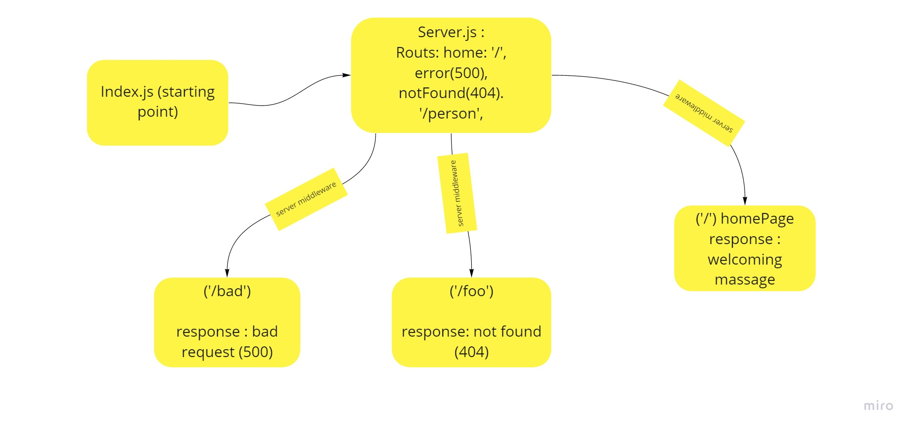

# server-deployment-practice

[The dev heroku link](https://yasmeen-server-deploy-dev.herokuapp.com/)

[The main heroku link](https://yasmeen-server-deploy-prod.herokuapp.com/)

## Install
Clone the repository from GitHub
Run the command npm i dotenv express jest supertest to install dependencies
create .env file with PORT variable
## Test
Run the command npm test to test and verify the server and the middleware are working.
Run the command npm run lint for testing lint.
## Run
Start the server using nodemon
Visit http://localhost:PORT at the PORT number you've assigned in your .env

## UML Diagram

